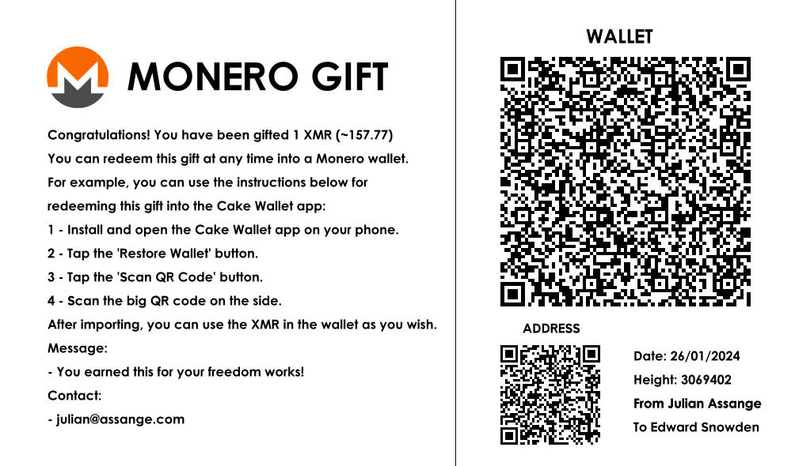

# Gem - Gift Easily Monero


Gem is a program that generates Monero paper wallets for gifting and tipping. It's name is abbreviation of "Gift Easily Monero".

# Building

Run `cargo run` in the main folder for a debug build. For a release build, run `cargo build --release`

# Donating

Any amount helps. Thank you!

Monero:
```
8C5jjbRYUoPUQqSHeMfTGfPGsahyfn6ty7kuoADduX4HinsCNd7eQ3fbCg5X99xvcSRPprprMpVMGXsgNEtdxug35hvi8a2
```